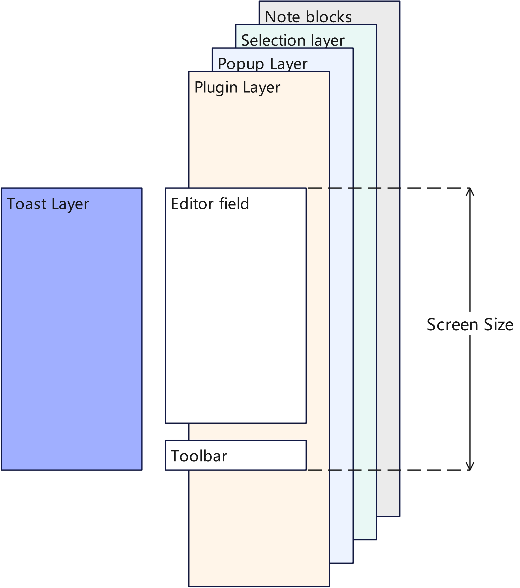

# Overview
Mesh Notes creates serveral layers to arrange UI elements. The overlay mechanism in Flutter is avoided to make the overlapping UI elements work properly.

Generally speaking, the application has a top most app layer, and then editor layers. App layer would not be affected by the user scroll up and down, while editor layers would follow the scroll.

# App Layers
Currently only a toast layer is used, to display messages to user.

# Editor Layers
There are 3 layers related to the editor.
1. Selection layer: to display the selection area(blue semitransparent rectangle) and handles(small blue rectangles for user to drag, only in mobile mode).
2. Popup menu layer: to display the popup menu, for user to select all, copy, cut, and paste.
3. Plugin tips layer: to display the plugin tips. Currently using for AI hints.
